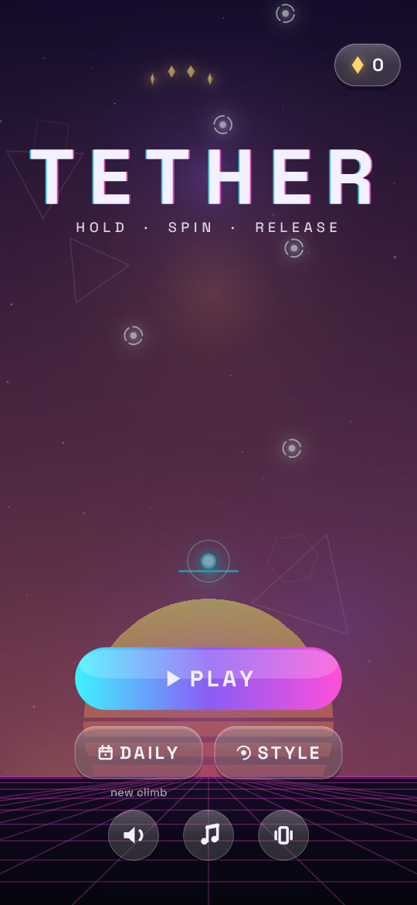
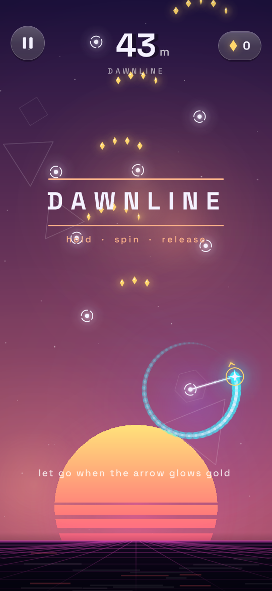
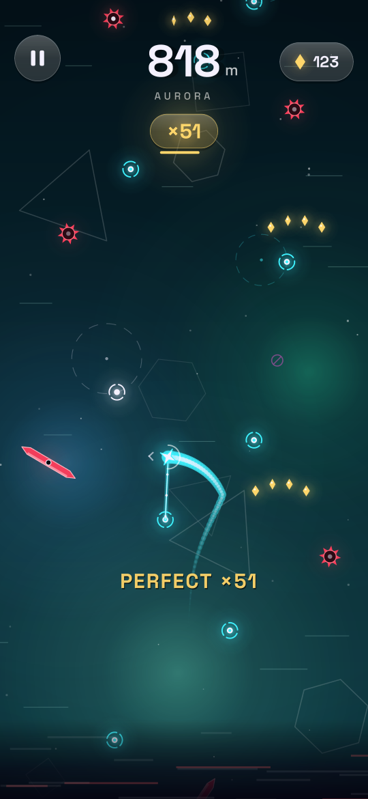
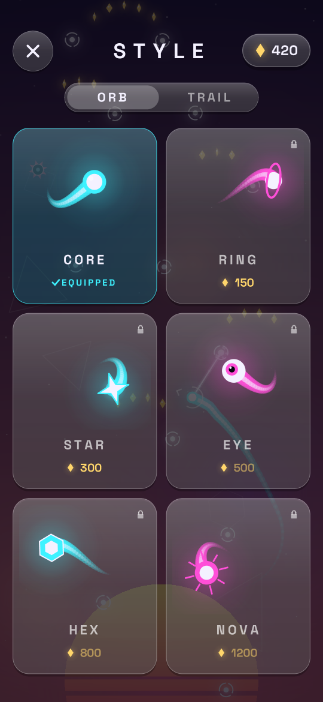

<p align="center">
  
</p>

<h1 align="center">Tether</h1>

<p align="center">
  <b>A one-touch neon sling climber for Android.</b><br>
  Hold to tether, spin, let go at the perfect moment, and climb before the static catches you.
</p>

<p align="center">
  <a href="https://github.com/pranvirsingh/Tether/releases/latest"></a>
  <a href="https://github.com/pranvirsingh/Tether/actions/workflows/ci.yml"></a>
  
  
  <a href="LICENSE"></a>
</p>

<p align="center">
  
  
  
  
</p>

## About

Tether is written in Kotlin with **no game engine and no third-party libraries**. Every frame is procedural vector art drawn on an Android `Canvas`, and all music and sound effects are synthesised on the device while you play. The whole game is a ~320 KB APK that needs **no permissions**: no internet, no ads, no tracking.

## How to play

- **Hold** to fire a tether at the nearest anchor of your colour.
- **Keep holding** to spin up around the anchor.
- **Let go** when the arrow glows gold. That's a perfect release, and it builds your combo.
- Prism gates flip your colour. Only white anchors and anchors in your colour will catch you.
- The static rises from below, so keep climbing.

## Zones

| Zone | Starts at | Hazards and twists |
|---|---|---|
| Dawnline | 0 m | Shards and mines |
| Nebula | 300 m | Low gravity, prism gates |
| Aurora | 700 m | Solar wind, fragile anchors |
| Eclipse | 1200 m | Darkness, laser beams |
| Singularity | 1800 m | Gravity wells; the climb is endless from here |

## Features

- **Endless climb** through five zones that blend into one another as you rise.
- **Daily Climb:** a run seeded from the calendar date, with its own best score that resets each day.
- **Style shop:** 6 orbs and 6 trails. The first of each is free; the rest are bought with the motes you collect while climbing.
- **Run summary:** metres, zone reached, perfect releases, best combo, near misses and motes.
- **Sound, music and vibration** can each be switched on or off. Progress, motes and unlocked styles are saved on the device, and the game pauses itself when you leave the app.

## Download

1. Open the [latest release](https://github.com/pranvirsingh/Tether/releases/latest) and download the `.apk`.
2. Open it on your phone. Android will ask you to allow installing apps from that source the first time.
3. Requires Android 7.0 (API 24) or newer.

## Build from source

`build.sh` produces `build/Tether.apk`. It needs:

- `aapt2`, `apksigner` and `d8.jar` (R8) from Android build-tools, plus `android.jar` for API 34
- the Kotlin compiler and standard library
- a JDK (for `java`, `jar` and `keytool`) and Python 3

The scripts expect the project at `/home/claude/tether` and the toolchain in `/home/claude/tc` under specific jar names. Those paths are hardcoded in `build.sh`, `kc.sh`, `t.sh` and in the `Shots`, `AudioTest` and `IconGen` tests. The easiest way to build is to recreate that layout, which is what [`.github/workflows/ci.yml`](.github/workflows/ci.yml) does on Ubuntu (build-tools 34, Kotlin 2.3.10, JDK 17) before running the scripts unchanged. On first run, `build.sh` creates a local signing key, so a locally built APK is for testing. It can't update an installed release build.

## Tests

The tests run on a plain JVM against a small Java2D shim of `android.graphics`:

```
mkdir -p shots      # Shots and AudioTest write their output here
./t.sh Shots Monkey AudioTest Sim
```

- **Shots:** renders every screen to `shots/` (the screenshots above come from here).
- **Monkey:** 60,000 random input steps with process-death restores, checking for leaks, NaNs and invalid state.
- **AudioTest:** checks that every sound effect is audible and every music stem has the right loop length.
- **Sim:** autopilot climbs across 12 seeds, reporting the height and zone each one reaches.

CI builds the APK and runs these tests on every pull request.

## Project layout

| Path | What it is |
|---|---|
| `src/com/pranvir/tether/World.kt` | Physics, level generation and hazards (pure Kotlin) |
| `src/com/pranvir/tether/Fx.kt` | All world and background rendering, cosmetics |
| `src/com/pranvir/tether/Game.kt` | Screens, buttons, scoring and saves |
| `src/com/pranvir/tether/Core.kt` | Colours, zone themes, fonts, drawing helpers, icons |
| `src/com/pranvir/tether/Synth.kt`, `Audio.kt` | Synthesised music stems, sound effects and the mixer |
| `src/com/pranvir/tether/MainActivity.kt` | Android entry point: view, input, haptics, storage |
| `jvmtest/` | JVM test harness and the `android.graphics` shim |
| `build.sh`, `kc.sh`, `zipalign.py`, `rules.pro` | Build: resources, Kotlin compile, R8, packaging, signing |

See [CHANGELOG.md](CHANGELOG.md) for release history.

## License

Code: [MIT](LICENSE) © 2026 Pranvir Singh.

Fonts: the bundled Space Grotesk fonts (`assets/fonts/sg_med.ttf`, `assets/fonts/sg_bold.ttf`) are © 2020 The Space Grotesk Project Authors, licensed under the [SIL Open Font License 1.1](docs/licenses/OFL-SpaceGrotesk.txt).
